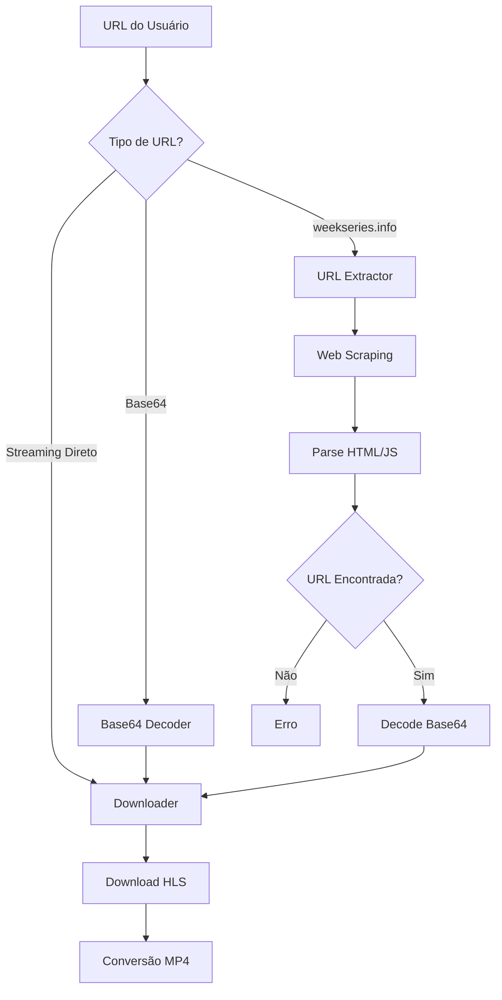

# Design Document

## Overview

Esta funcionalidade adiciona capacidade de extração automática de URLs de streaming a partir de URLs do weekseries.info. O sistema irá interceptar URLs do formato `https://www.weekseries.info/series/[serie]/temporada-[numero]/episodio-[numero]`, fazer scraping da página para encontrar a URL de streaming real (geralmente codificada em base64), e então proceder com o download usando a infraestrutura existente.

A implementação será modular, adicionando um novo módulo `extractor.py` que se integra perfeitamente com a CLI existente, mantendo compatibilidade total com URLs diretas de streaming.

## Architecture

### Componentes Principais

```
weekseries_downloader/
├── cli.py              # Interface CLI (modificada)
├── extractor.py        # Novo: Extração de URLs
├── downloader.py       # Existente: Download HLS
├── utils.py           # Existente: Utilitários
└── converter.py       # Existente: Conversão MP4
```

### Fluxo de Dados



## Components and Interfaces

### 1. URL Extractor Module (`extractor.py`)

```python
from typing import Protocol, Optional, Callable
from dataclasses import dataclass

# Dependency Injection Protocols
class HttpClient(Protocol):
    def fetch(self, url: str, headers: dict) -> Optional[str]: ...

class HtmlParser(Protocol):
    def parse_stream_url(self, content: str) -> Optional[str]: ...

class Base64Decoder(Protocol):
    def decode(self, encoded: str) -> Optional[str]: ...

# Core extraction function with dependency injection
def extract_stream_url(
    page_url: str,
    http_client: HttpClient,
    html_parser: HtmlParser,
    base64_decoder: Base64Decoder,
    url_validator: Callable[[str], bool]
) -> ExtractionResult:
    """Extrai URL de streaming usando injeção de dependências"""
    
    # Early return para URL inválida
    if not url_validator(page_url):
        return ExtractionResult(
            success=False, 
            error_message="URL não é do weekseries.info"
        )
    
    # Early return para falha na requisição
    content = http_client.fetch(page_url, get_default_headers())
    if not content:
        return ExtractionResult(
            success=False,
            error_message="Falha ao obter conteúdo da página"
        )
    
    # Early return para falha no parsing
    encoded_url = html_parser.parse_stream_url(content)
    if not encoded_url:
        return ExtractionResult(
            success=False,
            error_message="URL de streaming não encontrada na página"
        )
    
    # Early return para falha na decodificação
    stream_url = base64_decoder.decode(encoded_url)
    if not stream_url:
        return ExtractionResult(
            success=False,
            error_message="Falha ao decodificar URL base64"
        )
    
    return ExtractionResult(
        success=True,
        stream_url=stream_url,
        referer_url=page_url
    )

# Pure functions for validation
def validate_weekseries_url(url: str) -> bool:
    """Valida se URL é do weekseries.info usando early return"""
    if not url:
        return False
    if not url.startswith(('http://', 'https://')):
        return False
    if 'weekseries.info' not in url:
        return False
    return WEEKSERIES_PATTERN.match(url) is not None

def get_default_headers() -> dict:
    """Retorna headers padrão para requisições"""
    return {
        'User-Agent': 'Mozilla/5.0 (Macintosh; Intel Mac OS X 10_15_7) AppleWebKit/537.36',
        'Referer': 'https://www.weekseries.info/',
        'Origin': 'https://www.weekseries.info',
        'Accept': '*/*'
    }
```

### 2. URL Detection Utility

```python
from enum import Enum

class UrlType(Enum):
    WEEKSERIES = "weekseries"
    DIRECT_STREAM = "direct_stream"
    BASE64 = "base64"
    UNKNOWN = "unknown"

def detect_url_type(url: str) -> UrlType:
    """Detecta tipo de URL usando early returns"""
    if not url:
        return UrlType.UNKNOWN
    
    if validate_weekseries_url(url):
        return UrlType.WEEKSERIES
    
    if is_stream_url(url):
        return UrlType.DIRECT_STREAM
    
    if is_base64_string(url):
        return UrlType.BASE64
    
    return UrlType.UNKNOWN

def is_stream_url(url: str) -> bool:
    """Verifica se é URL direta de streaming usando early return"""
    if not url:
        return False
    if not url.startswith(('http://', 'https://')):
        return False
    return url.endswith('.m3u8') or 'stream' in url.lower()

def is_base64_string(text: str) -> bool:
    """Verifica se string é base64 válida usando early return"""
    if not text:
        return False
    if len(text) < 4:
        return False
    if not re.match(r'^[A-Za-z0-9+/]*={0,2}$', text):
        return False
    return True
```

### 3. CLI Integration

Modificações na CLI usando padrão funcional:

```python
# Dependency injection setup
def create_dependencies() -> dict:
    """Cria dependências para injeção"""
    return {
        'http_client': UrllibHttpClient(),
        'html_parser': RegexHtmlParser(),
        'base64_decoder': StandardBase64Decoder(),
        'url_validator': validate_weekseries_url
    }

def process_url_input(
    url: Optional[str], 
    encoded: Optional[str],
    dependencies: dict
) -> tuple[Optional[str], Optional[str]]:
    """Processa input de URL usando early returns"""
    
    # Early return para URL codificada
    if encoded:
        decoded = dependencies['base64_decoder'].decode(encoded)
        if not decoded:
            return None, "Falha ao decodificar URL base64"
        return decoded, None
    
    # Early return se não há URL
    if not url:
        return None, "Você precisa fornecer --url ou --encoded"
    
    url_type = detect_url_type(url)
    
    # Early return para URL direta
    if url_type == UrlType.DIRECT_STREAM:
        return url, None
    
    # Early return para URL do weekseries
    if url_type == UrlType.WEEKSERIES:
        result = extract_stream_url(url, **dependencies)
        if not result.success:
            return None, result.error_message
        return result.stream_url, None
    
    return None, f"Tipo de URL não suportado: {url}"

@click.command()
def main(url, encoded, output, referer, no_convert):
    """CLI principal usando padrão funcional"""
    dependencies = create_dependencies()
    
    stream_url, error = process_url_input(url, encoded, dependencies)
    if error:
        click.echo(f"❌ {error}", err=True)
        sys.exit(1)
    
    # Define referer automaticamente para URLs do weekseries
    if not referer and url and detect_url_type(url) == UrlType.WEEKSERIES:
        referer = url
    
    # ... resto da lógica existente
```

## Data Models

### URL Pattern Matching

```python
WEEKSERIES_PATTERN = re.compile(
    r'https?://(?:www\.)?weekseries\.info/series/([^/]+)/temporada-(\d+)/episodio-(\d+)'
)

class EpisodeInfo:
    """Informações extraídas da URL"""
    series_name: str
    season: int
    episode: int
    original_url: str
```

### Extraction Result

```python
@dataclass
class ExtractionResult:
    """Resultado da extração de URL"""
    success: bool
    stream_url: Optional[str] = None
    error_message: Optional[str] = None
    referer_url: Optional[str] = None
```

## Error Handling

### Tipos de Erro

1. **URL Inválida**: URL não segue padrão esperado
2. **Página Não Encontrada**: Episódio não existe no site
3. **Parsing Falhou**: Não conseguiu encontrar URL de streaming na página
4. **Rede**: Problemas de conectividade
5. **Decodificação**: Falha ao decodificar base64

### Estratégias de Tratamento

```python
class ExtractionError(Exception):
    """Erro base para extração de URLs"""
    pass

class InvalidURLError(ExtractionError):
    """URL não segue padrão esperado"""
    pass

class PageNotFoundError(ExtractionError):
    """Página/episódio não encontrado"""
    pass

class ParsingError(ExtractionError):
    """Falha ao parsear conteúdo da página"""
    pass
```

### Fallback e Retry Logic

- Retry automático para erros de rede (até 3 tentativas)
- Timeout configurável para requisições HTTP
- Fallback para diferentes métodos de parsing se um falhar
- Cache de URLs extraídas para evitar requisições desnecessárias

## Testing Strategy

### Unit Tests

1. **URL Validation Tests**
   - URLs válidas do weekseries.info
   - URLs inválidas (domínio errado, formato incorreto)
   - URLs de streaming direto
   - URLs base64

2. **HTML Parsing Tests**
   - Mock de páginas HTML com diferentes estruturas
   - Teste com JavaScript inline e externo
   - Teste com URLs base64 em diferentes formatos

3. **Integration Tests**
   - Teste end-to-end com URLs reais (usando VCR.py para cache)
   - Teste de compatibilidade com CLI existente
   - Teste de fallback para URLs diretas

### Error Handling Tests

- Simulação de erros de rede
- Páginas não encontradas (404)
- HTML malformado
- JavaScript não executável

### Performance Tests

- Tempo de extração para diferentes tipos de página
- Comportamento com múltiplas requisições simultâneas
- Uso de memória durante parsing de HTML grande

## Implementation Notes

### Web Scraping Considerations

1. **User Agent**: Usar mesmo User-Agent da CLI existente
2. **Headers**: Incluir headers apropriados (Referer, Origin)
3. **Rate Limiting**: Implementar delay entre requisições se necessário
4. **Caching**: Cache simples em memória para sessão atual

### JavaScript Handling

O site pode usar JavaScript para gerar URLs dinamicamente. Estratégias:

1. **Regex Parsing**: Buscar padrões base64 no HTML/JS
2. **BeautifulSoup**: Parse estruturado do HTML
3. **Selenium** (opcional): Para casos complexos com JS dinâmico

### Base64 Detection

Padrões comuns para detectar URLs base64:
- Strings que terminam com `=` ou `==`
- Strings com caracteres base64 válidos
- Contexto JavaScript (variáveis, atribuições)

### Backward Compatibility

- Manter todas as opções CLI existentes
- URLs diretas continuam funcionando sem mudanças
- Mensagens de erro claras sobre qual tipo de URL usar
- Documentação atualizada com exemplos dos dois formatos